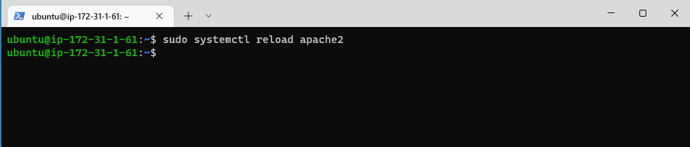

# PROJECT 1: 
STEP 1 - LAMP STACK IMPLEMENTATION DOCUMENTATION.

### INSTALLING APACHE AND UPDATING THE FIREWALL

### update a list of packages in package manager

`sudo apt update`

# apache2 package installation

`sudo apt install apache2`

### To verify that apache2 is running as a Service in our OS

`sudo systemctl status apache2`

### Adding a rule to EC2 configuration to open inbound connection through port 80:
                                                                                                 

### Checking if the server is running and it can be access  locally in  Ubuntu Shell, run:
Using this command 

`Curl http://localhost:80`

Also Using this command give same result 

`Curl http://127.0.0.1:80`

These 2 commands above actually do pretty much the same – they use ‘curl’ command to request our Apache HTTP Server on port 80 (actually you can even try to not specify any port – it will work anyway). The difference is that: in the first case we try to access our server via DNS name and in the second one – by IP address (in this case IP address 127.0.0.1 corresponds to DNS name ‘localhost’ and the process of converting a DNS name to IP address is called "resolution"). We will touch DNS in further lectures and projects.

## Testing how our Apache HTTP server can respond to requests from the Internet.
`http://18.170.44.117/:80`

# STEP 2 - INSTALLATION OF MYSQL
Run this commands on AWS command line 

`sudo apt install mysql-server`

Type **YES** to continue

MYSQL Installation Complete

Loging into MYSQL

`sudo mysql`

Setting the root user password to Password.1

`ALTER USER 'root'@'localhost' IDENTIFIED WITH mysql_native_password BY 'PassWord.1';`

After the root password has been set ,Exit the MYSQL shell. 
Start the interactive script by running: 

`sudo mysql_secure_installation`

You can change the root password and desable of default setting because of the scurity flaws. Type Yes for all options.

Login to MYSQL after changing Password to verify password change.

`sudo mysql -p`

# STEP 3 - INSTALLING PHP
This command installs 3 packages at the sametime.

`sudo apt install php libapache2-mod-php php-mysql`

Type Yes to continue

To Verify the php installation and version installed

`php -v`

# STEP 4 - CREATING A VIRTUAL HOST FOR HOST WEBSITE USING APACHE

1. Create a domain called "projectlamp"

`sudo mkdir /var/www/projectlamp`

2. Asign ownership of the directory of the current user

`sudo chown -R $USER:$USER /var/www/projectlamp`

3. Create and open a new configuration file in Apache’s sites-available directory using your preferred command-line editor.

`sudo vi /etc/apache2/sites-available/projectlamp.conf` 

4. Creating a New Blank file.

5.Enabling the new virtual host.
 This shows the directorys avalaible

`sudo ls /etc/apache2/site-available`

This command enable the virtual host

`sudo a2ensite project`

6. To disable the dafault website that comes install with Apache.

`sudo a2disite 000-default`

To Make sure the configuration file doesnt conatin error

`sudo apache2ctl configtest`

Finally ,reload Apache so these change can take effect.

`sudo systemctl reload apache2` 

The new website is now active, but the web root /var/www/projectlamp is still empty. Create an index.html file in that location so that we can test that the virtual host works as expected:

`sudo echo 'Hello LAMP from hostname' $(curl -s http://169.254.169.254/latest/meta-data/public-hostname) 'with public IP' $(curl -s http://169.254.169.254/latest/meta-data/public-ipv4) > /var/www/projectlamp/index.html`

On the web browser, Open the website using the URL using IP Address

# STEP 5 - ENABLE PHP ON THE WEBSITE
1. Edit the /etc/apache2/mods-enabled/dir.conf file and change the order in which the index.php file is listed within the DirectoryIndex directive:

`sudo vim /etc/apache2/mods-enabled/dir.conf' 

<IfModule mod_dir.c>
        #Change this:
        #DirectoryIndex index.html index.cgi index.pl index.php index.xhtml index.htm
        #To this:
        DirectoryIndex index.php index.html index.cgi index.pl index.xhtml index.htm
</IfModule>

The index.html is changed to index.php ,while the index.php is change to index.htmls

2. After saving ,reload Apache so that the changes will take effect.

`ssudo sysstemctl reload apache2`

3. Create a new file named index.php inside the custom root folder.

`vim /var/www/projectlamp/index.php`

This will open a blank file. Add the following text, which is valid PHP code, inside the file

 save and close the file, refresh the page.

 

After checking the relevant information about the PHP server through the page, it’s best to remove the file  created as it contains sensitive information about the server environment -and the Ubuntu server. You can use rm to do so:

`sudo rm /var/www/projectlamp/index.php`
