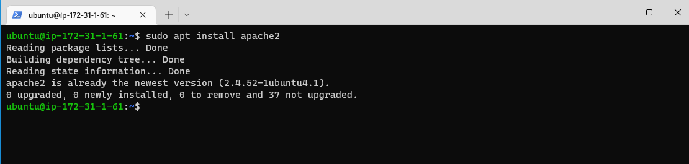
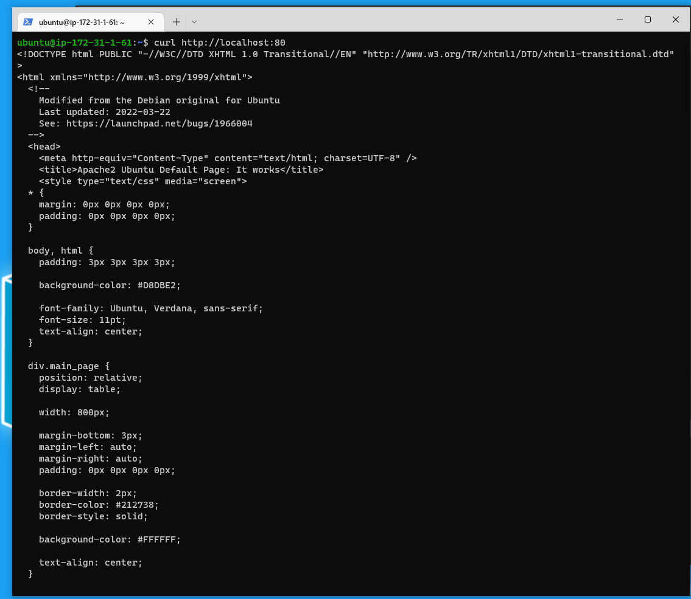
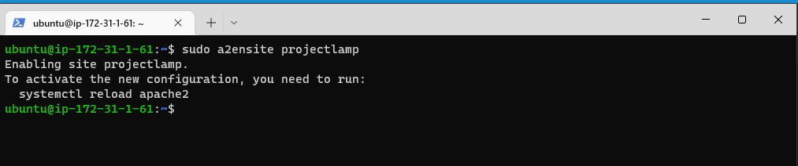

#  (STEP 1) PROJECT 1: LAMP STACK IMPLEMENTATION

##  INSTALLATING APACHE AND UPDATING THE FIREWALL
The Apache web server is among the most popular web servers in the world. It’s well documented, has an active community of users, and has been in wide use for much of the history of the web, which makes it a great default choice for hosting a website.


Conecting to our Aws Server via SSH on our windows terminal.


### Update  list of packages in package manager

`sudo apt update`


Install Apache using Ubuntu’s package manager ‘apt’:

`sudo apt install apache2`


### To verify that apache2 is running as a Service in our OS

`sudo systemctl status apache2`


### Adding a rule to EC2 configuration to open inbound connection through port 80:
                                                                                                 


### Checking if the server is running and it can be access  locally in  Ubuntu Shell, run:
Using this command 

`Curl http://localhost:80`




Also Using this command give same result 

`Curl http://127.0.0.1:80`


These 2 commands above actually do pretty much the same – they use ‘curl’ command to request our Apache HTTP Server on port 80 (actually you can even try to not specify any port – it will work anyway). The difference is that: in the first case we try to access our server via DNS name and in the second one – by IP address (in this case IP address 127.0.0.1 corresponds to DNS name ‘localhost’ and the process of converting a DNS name to IP address is called "resolution").

Testing how our Apache HTTP server will respond to requests from the Internet using live IP.
`http://18.170.44.117/:80`


# STEP 2 - INSTALLATION OF MYSQL
Run this commands on AWS command line 

`sudo apt install mysql-server`


Type **YES** to continue


MYSQL Installation Complete


Loging into MYSQL

`sudo mysql`


Setting the root user password to Password.1

`ALTER USER 'root'@'localhost' IDENTIFIED WITH mysql_native_password BY 'PassWord.1';`


After the root password has been set , Exit the MYSQL shell. 
Start the interactive script by running: 

`sudo mysql_secure_installation`

We can change the root password and also disable  default setting because of the scurity flaws. Type **Yes** for all options.


Login to MYSQL after changing Password to verify password change.

`sudo mysql -p`


# STEP 3 - INSTALLING PHP
This command installs 3 packages at the sametime.

`sudo apt install php libapache2-mod-php php-mysql`


Type **Yes** to continue


To Verify the php installation and version installed

`php -v`


At this point, our LAMP stack is completely installed and fully operational.

*Linux (Ubuntu)
*Apache HTTP Server
*MySQL
*PHP

To test our setup with a PHP script, it’s best to set up a proper Apache Virtual Host to hold our website’s files and folders. Virtual host allows us to have multiple websites located on a single machine and users of the websites will not even notice it.

# STEP 4 - CREATING A VIRTUAL HOST FOR HOST WEBSITE USING APACHE

Apache on Ubuntu 20.04 has one server block enabled by default that is configured to serve documents from the /var/www/html directory.
We will leave this configuration as is and will add our own directory next next to the default one.

1. Create a domain called "projectlamp"

`sudo mkdir /var/www/projectlamp`


2. Asign ownership of the directory of the current user

`sudo chown -R $USER:$USER /var/www/projectlamp`

3. Create and open a new configuration file in Apache’s sites-available directory .

`sudo vi /etc/apache2/sites-available/projectlamp.conf` 


This will create a new blank file. Paste in the following bare-bones configuration by hitting on i on the keyboard to enter the insert mode, and paste the text:

```{
<VirtualHost *:80>
    ServerName projectlamp
    ServerAlias www.projectlamp 
    ServerAdmin webmaster@localhost
    DocumentRoot /var/www/projectlamp
    ErrorLog ${APACHE_LOG_DIR}/error.log
    CustomLog ${APACHE_LOG_DIR}/access.log combined
</VirtualHost>
}
```


5.  This shows the directorys avalaible

`sudo ls /etc/apache2/site-available`


This command enable the virtual host

`sudo a2ensite project`



6. To disable the dafault website that comes install with Apache.

`sudo a2disite 000-default`

To Make sure the configuration file doesnt conatin error

`sudo apache2ctl configtest`

Finally ,reload Apache so these change can take effect.

`sudo systemctl reload apache2` 

The new website is now active, but the web root /var/www/projectlamp is still empty. Create an index.html file in that location so that we can test that the virtual host works as expected:

`sudo echo 'Hello LAMP from hostname' $(curl -s http://169.254.169.254/latest/meta-data/public-hostname) 'with public IP' $(curl -s http://169.254.169.254/latest/meta-data/public-ipv4) > /var/www/projectlamp/index.html`


On the web browser, Open the website using the URL using IP Address

http://<Public-IP-Address>:80


# STEP 5 - ENABLE PHP ON THE WEBSITE
1. Edit the /etc/apache2/mods-enabled/dir.conf file and change the order in which the index.php file is listed within the DirectoryIndex directive:

`sudo vim /etc/apache2/mods-enabled/dir.conf' 


```{
<IfModule mod_dir.c>
        #Change this:
        #DirectoryIndex index.html index.cgi index.pl index.php index.xhtml index.htm
        #To this:
        DirectoryIndex index.php index.html index.cgi index.pl index.xhtml index.htm
</IfModule>
}
```


The index.html is changed to index.php ,while the index.php is change to index.htmls


2. After saving ,reload Apache so that the changes will take effect.

`ssudo sysstemctl reload apache2`


3. Create a new file named index.php inside the custom root folder.

`vim /var/www/projectlamp/index.php`


This will open a blank file. Add the following text, which is valid PHP code, inside the file


 save and close the file, refresh the page.

 


After checking the relevant information about the PHP server through the page, it’s best to remove the file  created as it contains sensitive information about the server environment -and the Ubuntu server. You can use rm to do so:

`sudo rm /var/www/projectlamp/index.php`
